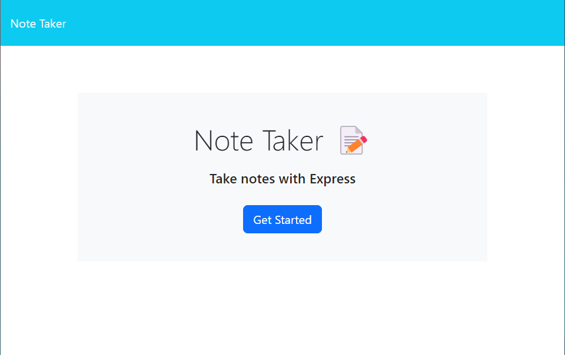
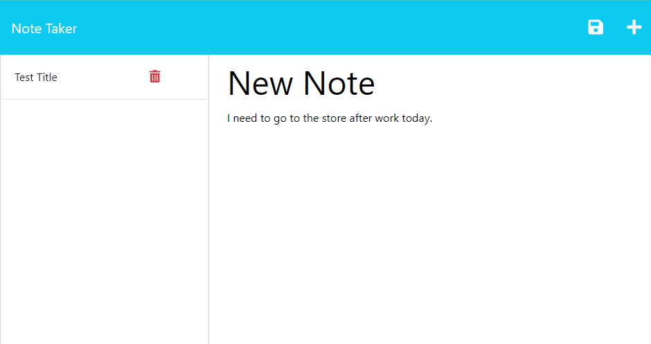

# Note-Taker

[](https://opensource.org/licenses/Apache-2.0)

This is a simple web-based note-taking application that allows users to create, save, and view notes. The application provides an intuitive interface to manage your notes effectively.

## Table of Contents

- [Description](#Description)
- [Installation](#Installation)
- [Usage](#Usage)
- [Technologies](#Technologies)
- [Deployment](#Deployment)
- [Contributing](#Contributing)
- [Credits](#Credits)
- [Questions](#Questions)
- [License](#License)

<a id="Description"></a>
## Description

The Note-Taking Application provides a convenient way to jot down and organize your thoughts, ideas, or important information. It offers the following features:

- **Landing Page:** Upon opening the application, you will be presented with a landing page that contains a link to the notes page.

- **Notes Page:** Clicking on the link from the landing page will take you to the notes page. Here, you will find a left-hand column displaying existing notes (if any) and a right-hand column with empty fields to enter a new note title and the note's text.

- **Saving a Note:** As you enter a new note title and the corresponding text, a "Save" icon will appear in the navigation bar at the top of the page.

- **Saved Notes:** Clicking on the "Save" icon will save the newly entered note, and it will appear in the left-hand column along with any existing notes.

- **Viewing Notes:** You can click on an existing note in the list displayed in the left-hand column to view its contents in the right-hand column.

- **Writing New Notes:** To create a new note, simply click on the "Write" icon in the navigation bar at the top of the page. This action will provide you with empty fields to enter a new note title and its text.

<a id="Installation"></a>
## Installation

To use the Note-Taker, follow these steps:

1. Clone the [repository](https://github.com/brendan-aper/Note-Taker) to your local machine.
2. Install the required dependencies:
  ```
  npm install
  ```
3. Start the application by running:
  ```
  npm start
  ```
4. Open your web browser and navigate to [http://localhost:3001](http://localhost:3001) to access the application.

**Alternatively** you can follow this [link](https://note-taker-brendan-aper-602ab156c5ec.herokuapp.com/) to view it live as it's deployed on Heroku.

<a id="Usage"></a>
## Usage

1. Upon opening the application in your web browser, you will be directed to the landing page.
2. Click on the ** Button ** that says, **"Get Started"**. This will navigate you to the notes page.
3. In the notes page, enter a new note title and its corresponding text in the right-hand column.
4. Once you have entered your note, you can save it by Clicking the **"Save"** icon in the top right of the nav bar.
5. The saved note will now be displayed on the left-hand column along with any existing notes.
6. If you want to create a new note, simply press the **" + "** icon that is also in the top right of the nav bar.
7. To delete saved notes, simply press the **RED "Trashcan"** icon that is displayed with the saved note.





<a id="Technologies"></a>
## Technologies

The Note-Taking Application's backend is built using Node.js and Express.js. Node.js is used as the server-side runtime environment, while Express.js is a web application framework for building robust and scalable web applications.

Additionally, the application uses the uuid package to generate a unique random ID for each saved note in the db.json file. This ID ensures that each note can be uniquely identified and managed in the database.

<a id="Deployment"></a>
## Deployment

The application is deployed on Heroku, a cloud platform that enables easy and scalable application hosting. You can access the live version of the Note-Taking Application by visiting [link](https://note-taker-brendan-aper-602ab156c5ec.herokuapp.com/)

<a id="Contributing"></a>
## Contributing

Contributions are not welcome at this time. Thanks.

<a id="Credits"></a>
## Credits

Source code for this project was supplied by the [EDX Coding Bootcamp](https://github.com/coding-boot-camp)
This is include all the front end. My task was to create the whole back-end for this application.

<a id="Questions"></a>
## Questions

Follow me on [Github](https://github.com/brendan-aper)
Or if you have any questions please feel free to [email](mailto:brendanaper@gmail.com) me.

<a id="License"></a>
## License

Copyright [2023] [Brendan Aper]

Licensed under the Apache License, Version 2.0 (the "License");
you may not use this file except in compliance with the License.
You may obtain a copy of the License at

    http://www.apache.org/licenses/LICENSE-2.0

Unless required by applicable law or agreed to in writing, software
distributed under the License is distributed on an "AS IS" BASIS,
WITHOUT WARRANTIES OR CONDITIONS OF ANY KIND, either express or implied.
See the License for the specific language governing permissions and
limitations under the License.